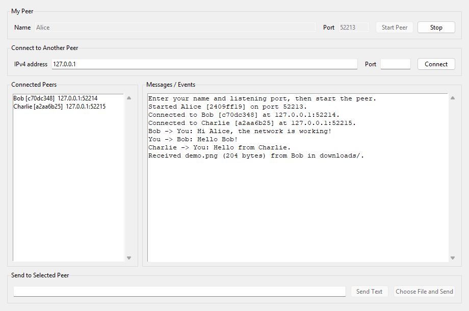

# Peer-to-Peer Network: Communication and File Sharing

**Course:** CSE 433, Blockchain & Distributed Security Lab  
**Student ID:** 22201270  
**Section:** E2

This Python application lets several peers communicate directly over TCP, with no central server. Every running copy listens for incoming connections and can connect to another peer. You can send text or any ordinary binary file to a selected connected peer. Received files appear in that copy's downloads/ folder.

## Requirements and setup

- Python 3.9 or later with the standard tkinter module.
- Windows, Linux, or macOS.
- Two or more terminals for testing on one computer, or computers on the same LAN for a live demonstration.
- No third-party packages. requirements.txt is included to document this.

Unzip the project. Open a terminal in the folder containing main.py and run:

    python main.py

On Windows, if PowerShell says "Python was not found", use the Python launcher:

    cd C:\code\Assignment\P2P_Network
    py -3 main.py

If you extracted the ZIP somewhere else, change the cd path to that extracted project folder. Run the same command in a second PowerShell window to start another peer.

On some Linux distributions, Tkinter is packaged separately as python3-tk.

## Connect two peers

1. Open two application windows with python main.py.
2. In the first window, enter Alice and listening port 5000; click **Start Peer**.
3. In the second window, enter Bob and listening port 5001; click **Start Peer**.
4. In Bob's window, enter remote IP 127.0.0.1 and remote port 5000; click **Connect**.
5. Both windows should now show the other peer's name and ID in **Connected Peers**.

For separate computers, replace 127.0.0.1 with the listener's IPv4 address on the LAN. Allow the chosen listening port through the operating system firewall if needed. Each instance on one computer needs a different listening port.

## Send text and files

1. Click a peer in **Connected Peers**.
2. Type a message and click **Send Text** (or press Enter).
3. To send a file, click **Choose File and Send**, then select an image, audio, video, PDF, ZIP, text, or another ordinary file.
4. Watch the event log for send and receive messages. Received files are stored in the receiving instance's downloads/ folder. If a name already exists, the app adds (1), (2), and so on, rather than overwriting it.

The **Stop** button disconnects that instance. Closing the window also stops it.

## Example screenshot

The screenshot below was captured from the running Tkinter app during a three-peer loopback demonstration. Alice is connected to Bob and Charlie, and the log shows text and a received file.

## How it works

    Alice GUI -> Alice P2P node -> TCP socket <-> TCP socket <- Bob P2P node <- Bob GUI

- Each node binds and listens on its chosen port while also being able to initiate outgoing connections.
- The connecting peer sends a hello JSON message with its ID, name, and listening port. The receiver replies with hello_ack.
- Every JSON control message is sent as a four-byte network-order length followed by UTF-8 JSON. This framing is necessary because TCP delivers a byte stream, not individual messages.
- A text message is a framed JSON object.
- A file transfer sends framed JSON metadata (filename and filesize) followed by exactly that many raw bytes. Both ends process file content in 64 KiB chunks, so large files are not loaded into memory at once.
- An incoming socket has its own reader thread. A per-connection lock keeps file metadata and bytes together when multiple GUI actions send through the same socket.
- No message relay or central directory is used. To talk directly, peers must connect using an IP address and port.

The implementation accepts IPv4 addresses, uses plain TCP, and has no authentication or encryption. Use it with peers you trust on a local network. Internet NAT traversal and routing are outside this assignment's scope.

## Testing and demonstration

Run the automated loopback tests:

    python -m unittest discover -s tests -v

The tests start three peers, check bidirectional text messages, transfer a binary file larger than one chunk, transfer an empty file, protect existing filenames, reject invalid input, and remove a disconnected peer.

For the live demonstration:

1. Start Alice (5000), Bob (5001), and Charlie (5002).
2. Connect Bob to Alice, then Charlie to Alice and Bob.
3. Select different peers and send text in both directions.
4. Send an image, an audio file, and a video file; open each from the recipient's downloads/ folder.
5. Stop one peer and show that the others remain running and update their connected-peer lists.

When running several copies from the same extracted folder, all copies share its downloads/ directory. For a clear demonstration of which peer received a file, extract a separate project copy for each peer or use separate computers.

## Project files

| File | Purpose |
| --- | --- |
| main.py | Tkinter interface and event log |
| p2p_node.py | TCP listener, connections, handshake, text, and file transfer |
| protocol.py | JSON framing and exact-byte reads |
| requirements.txt | No third-party dependencies |
| tests/test_p2p.py | Local integration tests |
| downloads/ | Received files |
| screenshots/peer_demo.png | Example running-app screenshot |
